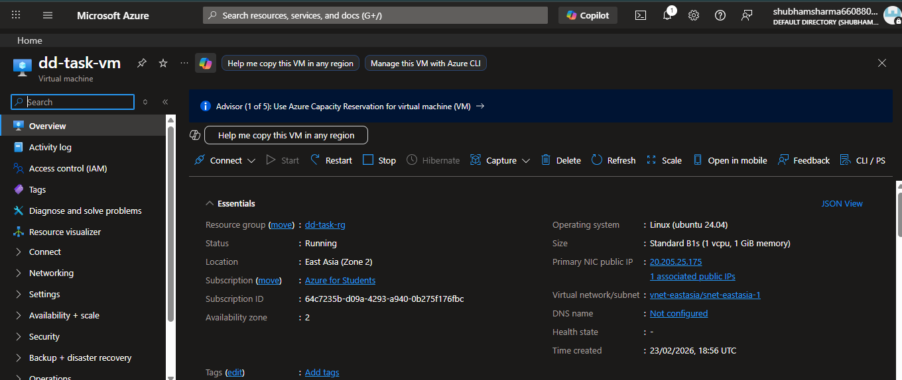
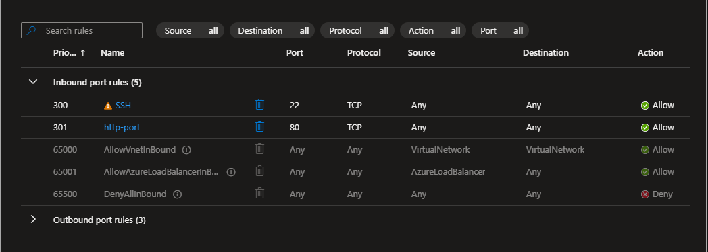
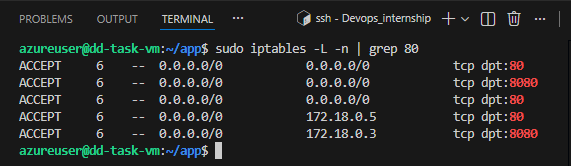
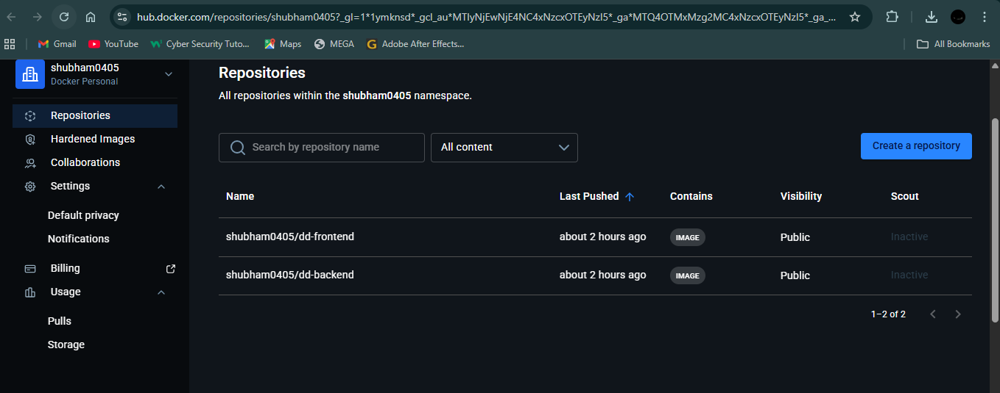
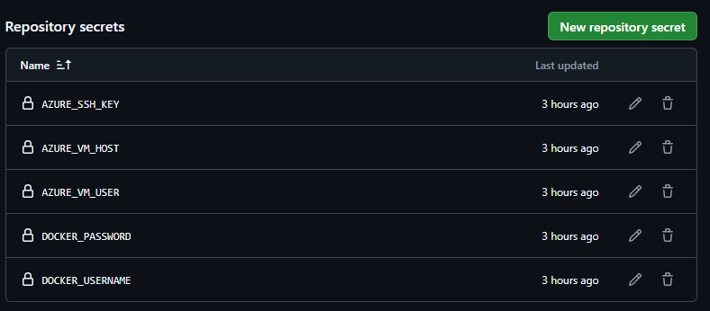
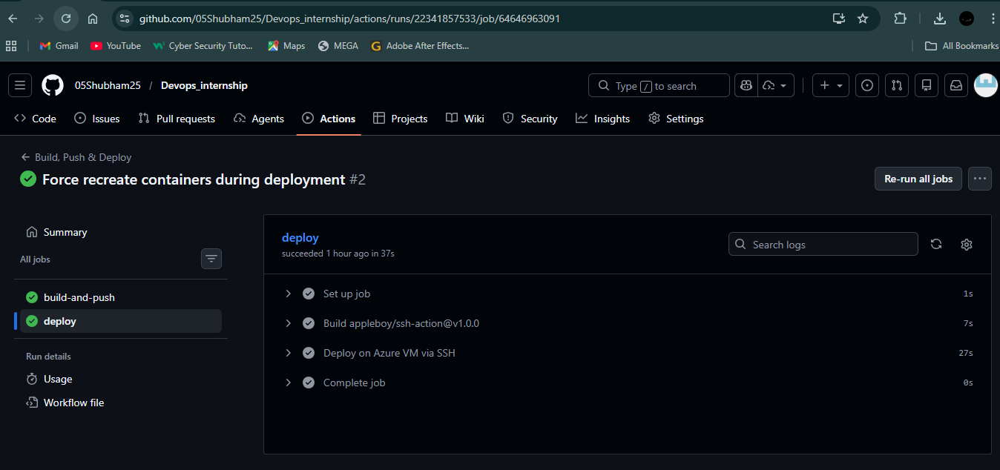
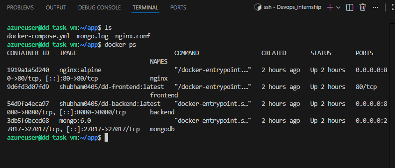
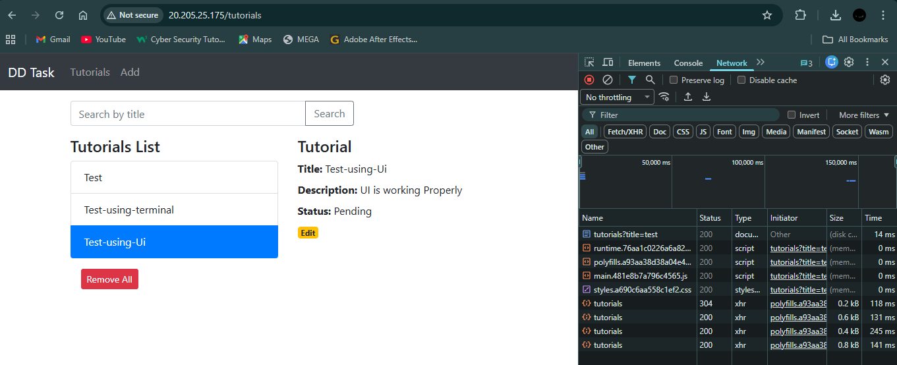
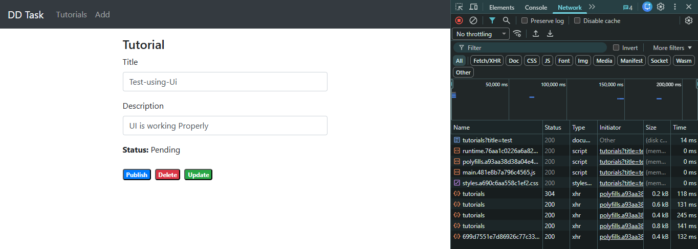
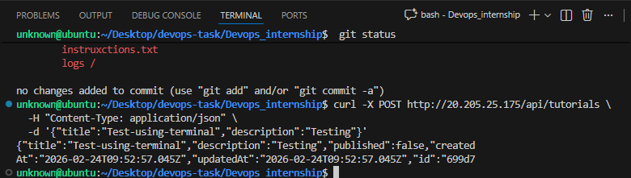

# DD Task — MEAN Stack CRUD App

Full-stack CRUD application with MongoDB, Express, Angular 15, and Node.js. Fully containerized with Docker and deployed on Azure VM with CI/CD via GitHub Actions.

##  Live Demo

**Application:** http://20.205.25.175

---

## 📸 Screenshots

### 1. Azure VM Configuration

*Ubuntu 24.04 VM running on Azure*

### 2. Network Security Group (NSG) Rules

*Port 80 (HTTP) and 22 (SSH) configured with proper source port settings*

### 3. iptables Rules in VM

*Docker automatically configured firewall rules*

### 4. Docker Images on Docker Hub

*Backend and Frontend images successfully pushed*

### 5. GitHub Secrets Configuration

*CI/CD secrets configured for automated deployment*

### 6. CI/CD Pipeline Working

*Automated build, push, and deploy workflow*

### 7. Docker Containers Running on VM

*All 4 containers (nginx, frontend, backend, mongodb) running successfully*

### 8. Application UI - Tutorials List

*CRUD application with tutorial list*

### 9. Edit Feature Working

*Update functionality in action*

### 10. API Testing via Terminal

*Backend API tested using curl command*

---

##  Tech Stack

- **Frontend:** Angular 15 + Nginx
- **Backend:** Node.js + Express
- **Database:** MongoDB 6.0
- **DevOps:** Docker, Docker Compose, GitHub Actions, Nginx
- **Cloud:** Azure VM (Ubuntu 24.04)

---

##  Project Structure

```
Devops_internship/
├── backend/              # Node.js REST API
│   ├── Dockerfile
│   ├── server.js
│   └── app/
├── frontend/             # Angular 15 app
│   ├── Dockerfile
│   └── nginx-frontend.conf
├── .github/workflows/
│   └── deploy.yml        # CI/CD pipeline
├── docker-compose.yml
├── nginx.conf            # Reverse proxy
└── .env
```

---

##  Setup & Deployment

### 1. Local Development

```bash

# Clone repository
git clone https://github.com/YOUR_USERNAME/Devops_internship.git
cd Devops_internship


# Check which GitHub repo connected hai
git remote -v

# Add only safe files (NOT the .pem key)
git add README.md
git add .github/workflows/deploy.yml

# Commit changes
git commit -m "<commit-message>"

# Push to GitHub
git push origin main


# Create .env file
cat > .env << EOF
MONGO_INITDB_DATABASE=dd_db
APP_PORT=8080
FRONTEND_PORT=80
EOF

# Start containers
docker compose up -d --build

# Access application
# App: http://localhost
# API: http://localhost/api/tutorials
```

### 2. Docker Hub Setup

```bash
# Login to Docker Hub
docker login

# Build and push backend
cd backend
docker build -t YOUR_USERNAME/dd-backend:latest .
docker push YOUR_USERNAME/dd-backend:latest

# Build and push frontend
cd ../frontend
docker build -t YOUR_USERNAME/dd-frontend:latest .
docker push YOUR_USERNAME/dd-frontend:latest
```

### 3. Azure VM Setup

**Create VM:**
- OS: Ubuntu Server 24.04 LTS
- Size: Standard_B2s (2 vCPU, 4 GB RAM)
- Ports: Open 22 (SSH) and 80 (HTTP)

**Configure NSG:**
- Add inbound rule for port 80
- Source: Any, Source port: `*`, Destination port: 80

**Install Docker:**
```bash
ssh -i your-key.pem azureuser@<VM-IP>

sudo apt update
sudo apt install -y docker.io docker-compose-plugin
sudo usermod -aG docker $USER
exit && ssh -i your-key.pem azureuser@<VM-IP>
```

**Deploy Application:**
```bash
mkdir -p ~/app && cd ~/app

# Copy docker-compose.yml, nginx.conf, and .env to VM
# Update image names in docker-compose.yml

docker compose up -d
docker ps  # Verify all 4 containers are running
```

### 4. GitHub Actions CI/CD

**Configure GitHub Secrets:**

Go to: Settings → Secrets and variables → Actions

| Secret | Value |
|--------|-------|
| `DOCKER_USERNAME` | Your Docker Hub username |
| `DOCKER_PASSWORD` | Docker Hub password/token |
| `AZURE_VM_HOST` | VM public IP |
| `AZURE_VM_USER` | azureuser |
| `AZURE_SSH_KEY` | Content of .pem file |

**Workflow (`.github/workflows/deploy.yml`):**

```yaml
name: Build, Push & Deploy

on:
  push:
    branches: [main]

jobs:
  build-and-push:
    runs-on: ubuntu-latest
    steps:
      - uses: actions/checkout@v3
      
      - name: Login to Docker Hub
        uses: docker/login-action@v3
        with:
          username: ${{ secrets.DOCKER_USERNAME }}
          password: ${{ secrets.DOCKER_PASSWORD }}
      
      - name: Build & Push Backend
        uses: docker/build-push-action@v5
        with:
          context: ./backend
          push: true
          tags: YOUR_USERNAME/dd-backend:latest
      
      - name: Build & Push Frontend
        uses: docker/build-push-action@v5
        with:
          context: ./frontend
          push: true
          tags: YOUR_USERNAME/dd-frontend:latest

  deploy:
    runs-on: ubuntu-latest
    needs: build-and-push
    steps:
      - name: Deploy to Azure VM
        uses: appleboy/ssh-action@v1.0.0
        with:
          host: ${{ secrets.AZURE_VM_HOST }}
          username: ${{ secrets.AZURE_VM_USER }}
          key: ${{ secrets.AZURE_SSH_KEY }}
          script: |
            cd ~/app
            docker compose pull
            docker compose up -d --force-recreate
```

---

##  Container Architecture

```
Browser (Port 80)
    ↓
Nginx (Reverse Proxy)
    ├── / → Frontend (Angular)
    └── /api/* → Backend (Node.js)
                    ↓
                MongoDB
```

| Container | Port | Description |
|-----------|------|-------------|
| nginx | 80 | Reverse proxy |
| frontend | - | Angular + Nginx |
| backend | 8080 | Node.js API |
| mongodb | 27017 | Database |

---

##  CI/CD Workflow

Push to `main` branch triggers:
1. Build Docker images (frontend + backend)
2. Push images to Docker Hub
3. SSH to Azure VM
4. Pull latest images
5. Recreate containers

---

##  API Endpoints

**Base URL:** `http://<VM-IP>/api`

| Method | Endpoint | Description |
|--------|----------|-------------|
| GET | `/tutorials` | Get all tutorials |
| GET | `/tutorials/:id` | Get by ID |
| POST | `/tutorials` | Create tutorial |
| PUT | `/tutorials/:id` | Update tutorial |
| DELETE | `/tutorials/:id` | Delete tutorial |
| DELETE | `/tutorials` | Delete all |
| GET | `/tutorials?title=xyz` | Search by title |

**Example:**
```bash
# Get all tutorials
curl http://<VM-IP>/api/tutorials

# Create tutorial
curl -X POST http://<VM-IP>/api/tutorials \
  -H "Content-Type: application/json" \
  -d '{"title":"Test","description":"Testing"}'
```

---

##  Useful Commands

**Docker:**
```bash
docker ps                              # Running containers
docker compose logs -f                 # View logs
docker compose restart                 # Restart all
docker compose down                    # Stop all
docker compose up -d --force-recreate  # Force recreate
docker stats                           # Resource usage
```

**Debugging:**
```bash
docker exec -it backend bash           # Shell into backend
docker exec -it mongodb mongosh        # MongoDB shell
docker compose logs backend            # Backend logs
docker compose logs nginx              # Nginx logs
```

---

##  Troubleshooting
**Port 80 not accessible:**
- Check Azure NSG allows port 80
- Verify source port is `*` (not 80)

**502 Bad Gateway:**
```bash
docker compose restart
# or
docker compose up -d --force-recreate
```

**CI/CD failing:**
- Verify GitHub Secrets are correct
- Check SSH key format (entire .pem content)
- View logs in Actions tab

**Database connection error:**
```bash
docker compose logs mongodb
docker compose restart mongodb
```

---

##  Configuration Files

**docker-compose.yml:**
```yaml
services:
  mongodb:
    image: mongo:6.0
    ports: ["27017:27017"]
    volumes: [mongo_data:/data/db]
  
  backend:
    image: YOUR_USERNAME/dd-backend:latest
    ports: ["8080:8080"]
    environment:
      - MONGO_URL=mongodb://mongodb:27017/dd_db
  
  frontend:
    image: YOUR_USERNAME/dd-frontend:latest
  
  nginx:
    image: nginx:alpine
    ports: ["80:80"]
    volumes: [./nginx.conf:/etc/nginx/nginx.conf:ro]

volumes:
  mongo_data:
```

**nginx.conf:**
```nginx
events {}
http {
  server {
    listen 80;
    
    location / {
      proxy_pass http://frontend:80;
    }
    
    location /api/ {
      proxy_pass http://backend:8080;
    }
  }
}
```

**Backend Dockerfile:**
```dockerfile
FROM node:18-alpine
WORKDIR /app
COPY package.json .
RUN npm install
COPY . .
EXPOSE 8080
CMD ["node", "server.js"]
```

**Frontend Dockerfile:**
```dockerfile
FROM node:18-alpine AS builder
WORKDIR /app
COPY package.json .
RUN npm install
COPY . .
RUN npm run build

FROM nginx:alpine
COPY --from=builder /app/dist/angular-15-crud /usr/share/nginx/html
COPY nginx-frontend.conf /etc/nginx/conf.d/default.conf
EXPOSE 80
CMD ["nginx", "-g", "daemon off;"]
```

---

##  Docker Hub

- **Backend:** https://hub.docker.com/r/shubham0405/dd-backend
- **Frontend:** https://hub.docker.com/r/shubham0405/dd-frontend

---

##  Author

**Shubham**
- GitHub: [@shubham0405](https://github.com/shubham0405)
- Docker Hub: [shubham0405](https://hub.docker.com/u/shubham0405)

---

*DevOps Internship Assignment - Discover Dollar Inc.*
